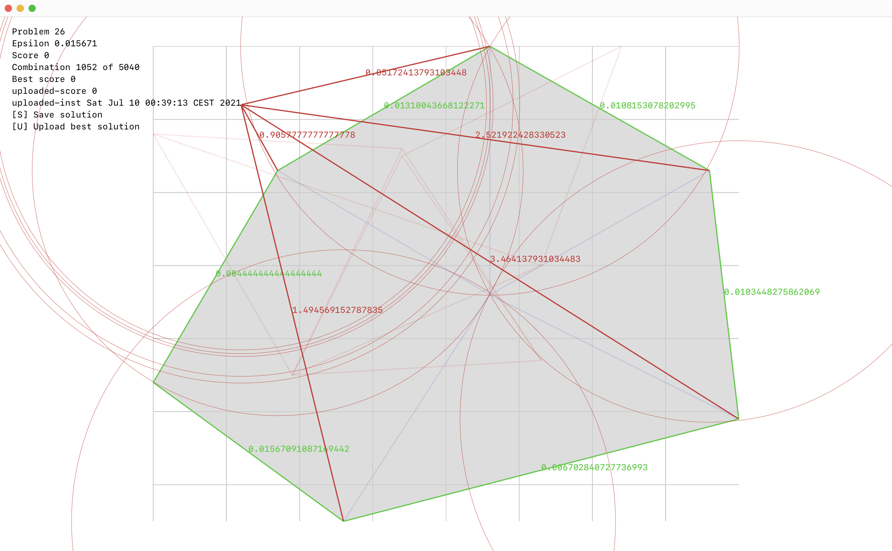

# ICFPC contest 2021

There are two parts: Clojure visual editor (manual, with some assist) and Zig bruteforce solver.

# Visualizer



To run Clojure:

```
clj -J-XstartOnFirstThread -M -m icfpc.main
```

`Left`-`right` arrows to switch between problems.
`Up`-`down` arrows to switch between saved solutions.
`S` to save a solution.
`U` to upload a solution (requires token).
`Space` + `mouse move` to move one or all vertices around.

Red edges have the wrong length. Red circles show the acceptable position for the vertex judged from the original length.

On tasks that have perfect 0-dislikes solution, pressing `C` will align a permutation of figure vertices with holes vertices and leave the rest for yourself to figure out.

# Bruteforce solver

The most straightforward thing possible: for each vertex, try all possible Xs and Ys, repeat for the rest of the figure.

Cut early if

- vertex is outside the hole
- edges are of the wrong lenght
- edges intersect with hole

Uses precomputed `inside` array and edges length matrix.

Run with

```
zig run -O ReleaseFast src/bruteforce.zig -- <problem-id> 1
```

For the problems where there is known 0-dislike solution, it changes the order vertices are considered. It first aligns a permutation of N vertices with holes and then does bruteforce on the rest.

Run with

```
zig run -O ReleaseFast src/bruteforce.zig -- <problem-id> 0
```

Thanks @ethercrow for the help.